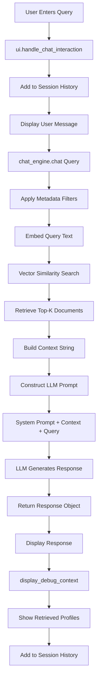
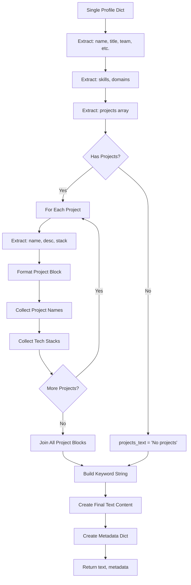
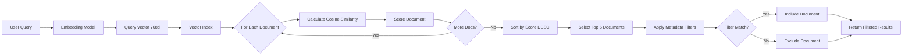
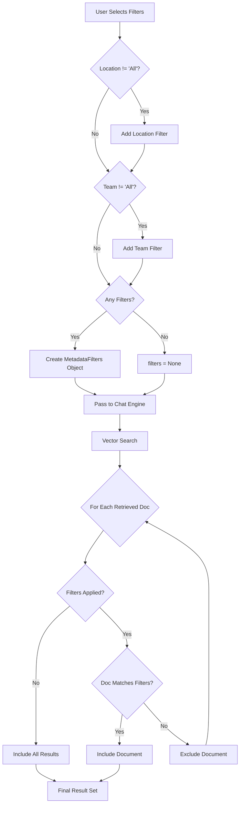
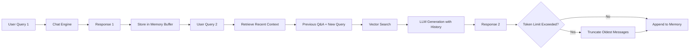
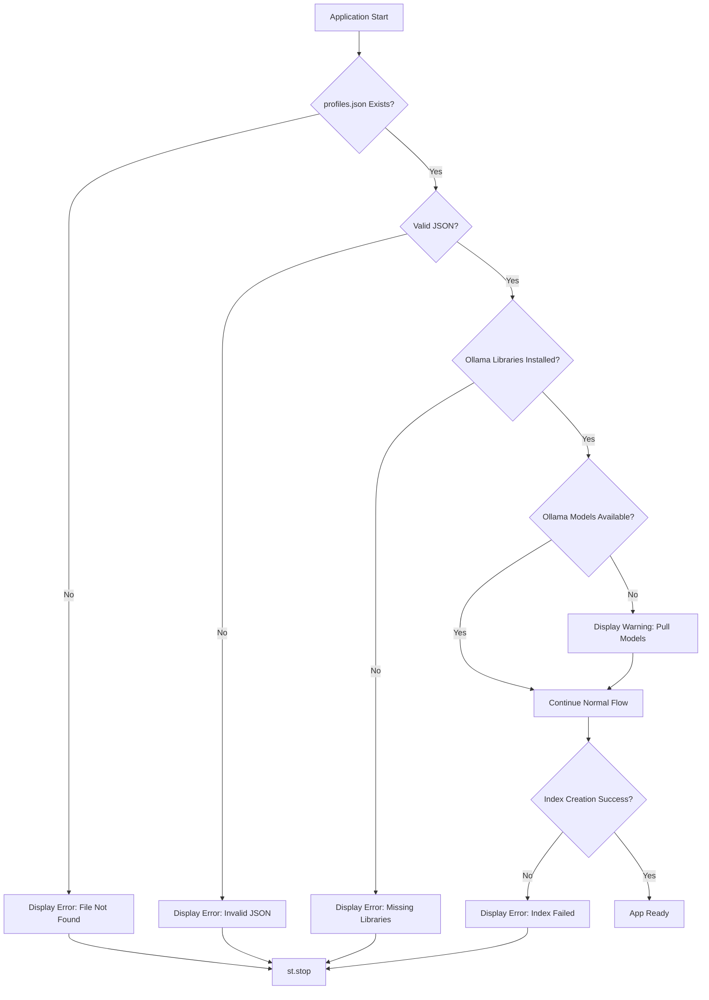
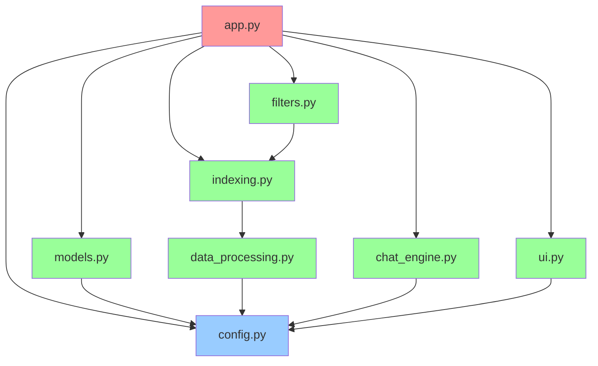
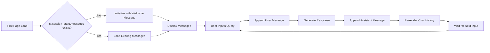
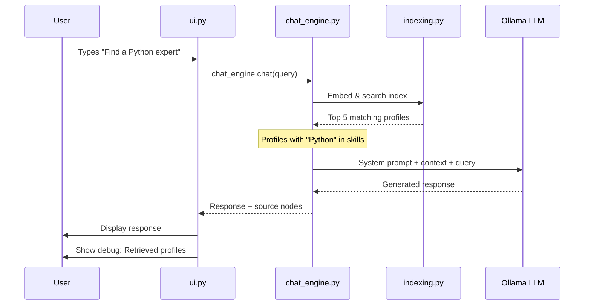

# Internal Expertise Finder - Flow Diagrams

## 📊 Complete Application Flow

This document provides detailed flow diagrams for understanding the application logic.

---

## 1. Application Startup Flow

```mermaid
graph TD
    A[User Starts App] --> B[app.py: main()]
    B --> C[ui.setup_page_config]
    C --> D[ui.display_header]
    D --> E[models.setup_global_settings]
    E --> F{Models Cached?}
    F -->|No| G[Initialize LLM & Embeddings]
    F -->|Yes| H[Load from Cache]
    G --> I[Set Global Settings]
    H --> I
    I --> J[indexing.create_vector_index]
    J --> K{Index Cached?}
    K -->|No| L[Load Profiles from JSON]
    K -->|Yes| M[Load from Cache]
    L --> N[Convert to Documents]
    N --> O[Create Vector Index]
    O --> P[Cache Index]
    M --> P
    P --> Q[filters.create_sidebar_filters]
    Q --> R[User Selects Filters]
    R --> S[filters.build_metadata_filters]
    S --> T[chat_engine.create_chat_engine]
    T --> U[ui.initialize_chat_session]
    U --> V[ui.display_chat_history]
    V --> W[Ready for User Input]
```

---

## 2. Data Processing Pipeline

```mermaid
graph LR
    A[profiles.json] --> B[load_profiles_from_json]
    B --> C[List of Profile Dicts]
    C --> D[convert_profiles_to_documents]
    D --> E[For Each Profile]
    E --> F[create_document_content]
    F --> G[Extract Basic Fields]
    G --> H[extract_project_information]
    H --> I[Format Document Text]
    I --> J[Build Metadata Dict]
    J --> K[Create LlamaIndex Document]
    K --> L[Append to Documents List]
    L --> M{More Profiles?}
    M -->|Yes| E
    M -->|No| N[Return Documents List]
    N --> O[VectorStoreIndex.from_documents]
```



---

## 3. Query Processing Flow



---

## 4. Document Creation Logic



**Final Document Format**:
```
Employee Name: Alice Johnson
Role: Senior Backend Engineer (Backend Team)
Location: Bangalore
Email: alice@company.com
Experience: 5 years
Skills: Python, Node.js, PostgreSQL
Domains: E-commerce, Payments
Projects:
  * PROJECT: Payment Gateway v2
    - Description: Redesigned payment processing
    - Tech Stack: Python, FastAPI, Redis
  * PROJECT: Order Management System
    - Description: Built scalable order processing
    - Tech Stack: Node.js, MongoDB, Kafka
--- Search Keywords ---
Alice Johnson, Backend Team, Python, Node.js, E-commerce, Payment Gateway v2, Order Management System, FastAPI, Redis, MongoDB
```

---

## 5. Vector Search Process



---

## 6. Filter Application Logic



---

## 7. Chat Memory Management



**Memory Configuration**:
- Token Limit: 4000 tokens
- Type: ChatMemoryBuffer
- Truncation: FIFO (oldest messages dropped first)

---

## 8. Error Handling Flow



---

## 9. Module Dependency Graph



**Legend**:
- 🔴 Main Entry Point (app.py)
- 🔵 Configuration (config.py)
- 🟢 Functional Modules

---

## 10. Session State Management



**Session State Structure**:
```python
st.session_state.messages = [
    {"role": "assistant", "content": "Welcome message"},
    {"role": "user", "content": "User query 1"},
    {"role": "assistant", "content": "Response 1"},
    # ... more messages
]
```

---

## 11. Caching Strategy

```mermaid
graph TD
    A[Function Called] --> B{@st.cache_resource?}
    B -->|Yes| C{Cached Result Exists?}
    B -->|No| D[Execute Function]
    C -->|Yes| E[Return Cached Result]
    C -->|No| F[Execute Function]
    F --> G[Store in Cache]
    G --> H[Return Result]
    E --> I[Fast Response]
    D --> J[Normal Execution]
    H --> I
```

**Cached Functions**:
1. `models.initialize_models()` - LLM & embedding models
2. `indexing.create_vector_index()` - Vector index

**Cache Invalidation**:
- Models: Never (unless Streamlit cache cleared)
- Index: When `profiles.json` file changes

---

## 12. End-to-End Example: Finding a Python Expert



**Retrieved Context Example**:
```
Employee Name: Alice Johnson
Skills: Python, Django, FastAPI
Projects: Payment Gateway (Python, FastAPI)

Employee Name: Bob Smith
Skills: Python, Data Science, TensorFlow
Projects: ML Model Pipeline (Python, TensorFlow)
```

**LLM Response**:
```
Found 2 Python experts:

1. **Alice Johnson** (Senior Backend Engineer)
   - **Expertise**: Python, Django, FastAPI
   - **Relevant Project**: Payment Gateway using FastAPI
   - **Experience**: 5 years

2. **Bob Smith** (Data Scientist)
   - **Expertise**: Python, Data Science, TensorFlow
   - **Relevant Project**: ML Model Pipeline
   - **Experience**: 4 years
```

---

## Summary of Key Flows

| Flow | Trigger | Duration | Cached? |
|------|---------|----------|---------|
| App Startup | User opens app | ~5-10s first time | Yes (after first run) |
| Data Loading | Startup | ~1-2s | Yes |
| Index Creation | Startup | ~2-3s | Yes |
| Query Processing | User input | ~2-5s | No |
| Filter Change | User selection | Instant | No |
| Model Loading | Startup | ~3-5s | Yes |

---

## Performance Optimization Points

1. **Model Caching**: Prevents re-loading 1GB+ models
2. **Index Caching**: Avoids re-embedding all documents
3. **Top-K Limitation**: Limits LLM context size
4. **Metadata Filtering**: Reduces search space
5. **Local LLM**: No API latency
